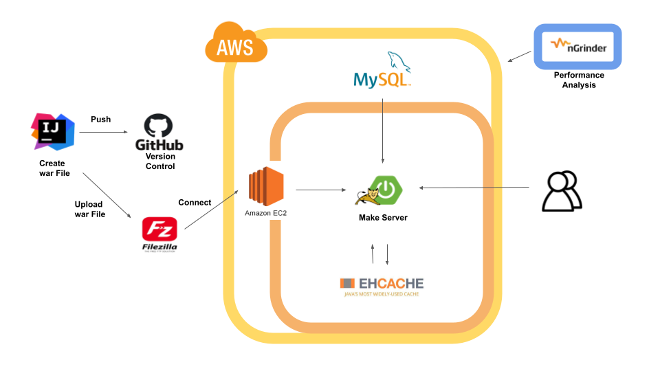

- [x] 리드미 작성
- [ ] 에러해결과정 정리
- [ ] 배포 링크 등록

	<h3>📚 " 개발자 스터디 모임 플랫폼" 📚</h3>

  

- 해당 프로젝트를 **기능추가, 리팩토링**하여 발전시킨 [**REST API 서버**]가 제작되었습니다.
  - [**REST API 서버**] 스터디 모임 API 서버: https://github.com/SebinYu/CodingFriends-REST-API

# 📖 개요
### 제안배경
- 온라인 스터디 도중 스터디원의 갑작스런 연락 중단을 경험
- 이에 문제인식을 느끼고 모임을 끝까지 마칠 수 있는 스터디 모임 플랫폼 제작  
  - 스터디 모임 종료후 → 모든 스터디원 참여 점수 공개(별점 및 리뷰글 기반)
  - 플랫폼 이름 = Coding Friends
    

### [REST API 서버] 프로젝트 목표
- 스터디 모집 및 진행 → 진행 종료 후: 스터디원 참여 점수 공개(별점 및 리뷰글) API를 제공합니다.
   

# 📖 인프라 구조도

   

# 📖 기술스택
- Back-end : Java11, Spring Boot 2.7.8, Maven
- Front-end : - Javascript, HTML5, CSS, Ajax, JQuery
- Database: MySQL 8.0, MyBatis, Ehcache
- DevOps: AWS - EC2, RDS
- Tools: IntelliJ, Ngrinder, Ubuntu, Vim, Git, Notion
     

# 🔥 프로젝트 중점사항 🔥
### 요약
- **DB 커넥션**을 최소하기 위해 사용도가 높은 조회 데이터는 **Ehcache 캐시**를 활용
  - NGrinder를 통해 Ehcache 활용 전과 후를 비교하여 검증
- 로그인, 회원가입 개발
- 스터디 모집 게시판 CRUD 개발
- 조직장을 위한 스터디 관리 페이지 개발
- 회원 프로필 조회 개발
- 스터디원 참여도 점수 작성 개발
- 간단한 프론트 페이지 구현 - View 화면 제작
  - Ajax로 기본적인 api 통신 개발
  - JQuery를 통한 개발
- EC2를 통한 배포
     

# 📖 비즈니스 목표
스터디원이 모임 종료후 → 후기가 남는 것을 의식하여 모임을 끝까지 마칠 수 있는 스터디 모임 플랫폼 제작
### 비즈니스 목표 달성을 위한 기능 요구사항
🔵 파란색: 서비스/ 🟢초록색: 기능 구현 완료/ ⚪ 흰색: 기능 설명   

# 📖 ERD

