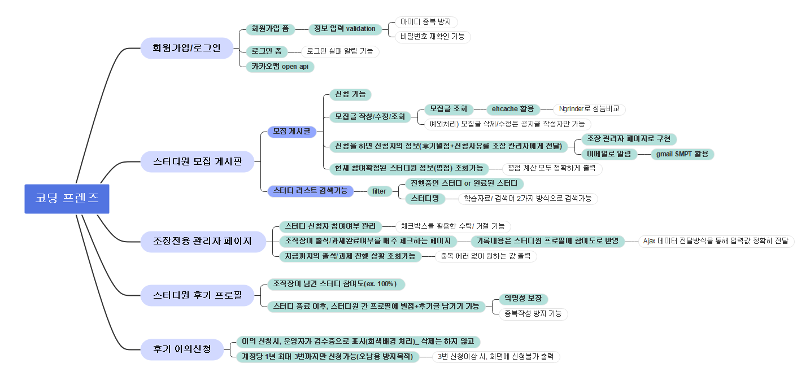
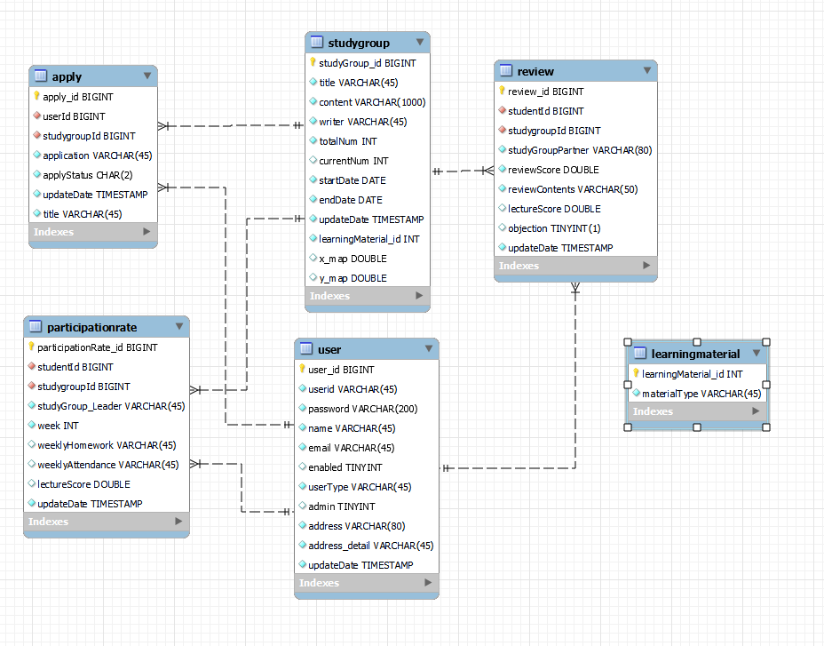

- [x] 리드미 작성
- [ ] 에러해결과정 정리
- [ ] 배포 링크 등록

	

	<h3>📚 " 개발자 스터디 모임 플랫폼" 📚</h3>

  

- 해당 프로젝트를 [**기능추가, 리팩토링한 REST API 서버**]가 제작되었습니다.
  - [**REST API 서버**] 스터디 모임 API 서버: https://github.com/SebinYu/CodingFriends-REST-API

# 📖 개요
### 제안배경
- 온라인 스터디 도중 스터디원의 갑작스런 연락 중단을 경험
- 이에 문제인식을 느끼고 익명의 온라인 스터디모임을 참여 시,  
  스터디원이 모임 종료후 → 후기가 남는 것을 의식하여 모임을 끝까지 마칠 수 있는 개발자 스터디 모임 플랫폼 제작 = 이름: Coding Friends
  

### [REST API 서버] 프로젝트 목표
- 스터디 모집 및 진행 → 진행 종료 후: 스터디원 참여 점수 공개(별점 및 리뷰글) API를 제공합니다.
   

# 📖 기술스택
- Back-end : Java11, Spring Boot 2.7.8, Maven
- Front-end : - Javascript, HTML5, CSS, Ajax, JQuery
- Database: MySQL 8.0, MyBatis, Ehcache
- DevOps: AWS - EC2, RDS
- Tools: IntelliJ, Ngrinder, Ubuntu, Vim, Git, Notion
     

# 🔥 프로젝트 중점사항 🔥
### 요약
- View 화면 제작 및 서버 구현
- 프론트 엔트, 백엔드 데이터 통신: Ajax, JQuery
- 대규모 트래픽 대처 (Ehcache 캐시)
- 보안이슈: (회원 비밀번호 암호화/ 로그상 비밀번호 확인 제어)
- 성능 테스트: (Ngrinder )
     

# 📖 비즈니스 목표
스터디원이 모임 종료후 → 후기가 남는 것을 의식하여 모임을 끝까지 마칠 수 있는 스터디 모임 플랫폼 제작
### 비즈니스 목표 달성을 위한 기능 요구사항
🔵 파란색: 서비스/ 🟢초록색: 기능 구현 완료/ ⚪ 흰색: 기능 설명   

# 📖 ERD

